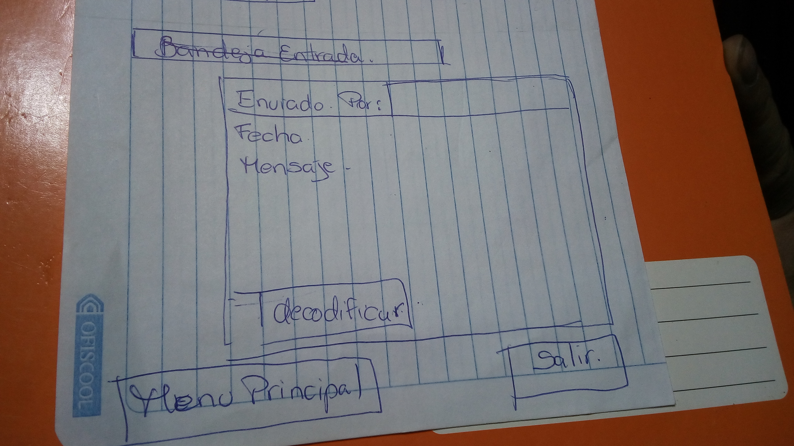

# Cifrado César

1- Explicar quienes son  los usuarios y los objetivos en relacion con el producto

Este producto esta dirigido a los usuarios que tienen acceso al sistema policial y que tienen la necesidad
de enviar ordenes y documentos de caracter confidencial o reservado debidamente encriptados para no cometer infidencia o  ser decifrados por el publico en general.

2- Explicar como el producto soluciona los problemas y las necesidades de dichos usuarios

Luego que el programa ha sido probado los usuarios tendran la certeza de que sus mensajes o la informacion que se remita al destinatario llegara con la estricta reserva evitando cualquier intento boicotear dicha informacion logrando los propositos deseados.

 # UX (Prototipo en papel)
 
 
 
 
 
 
 # Agregar un resumen del feedback recibido del prototipo en papel

 - Mis compañeras hicieron feedback de mi proyecto en el cual no necesitaba muchas ventanas.
 - deberia colocarle solo dos opciones para escoger,
 - faltaba ponerle una opcion el cual me permita escoger cuantos lugares iba a correr el encriptado.
 # IMAGEN DEL PROTOTIPO FINAL
 

## Objetivos de aprendizaje Cipher
​
A continuación te presentamos los objetivos de aprendizaje de este proyecto. Reflexiona y luego marca los objetivos que has llegado a **entender** y **aplicar** en tu proyecto.
​
### UX
​
- [x] Diseñar la aplicación pensando y entendiendo al usuario.
- [x] Crear prototipos para obtener feedback e iterar.
- [x] Aplicar los principios de diseño visual (contraste, alineación, jerarquía).
​
### HTML y CSS
​
- [x] Uso correcto de HTML semántico.
- [x] Uso de selectores de CSS.
- [x] Construir tu aplicación respetando el diseño realizado (maquetación).
​
### DOM
​
- [ ] Uso de selectores del DOM.
- [x] Manejo de eventos del DOM.
- [ ] Manipulación dinámica del DOM.
​
### Javascript
​
- [x] Manipulación de strings.
- [x] Uso de condicionales (if-else | switch).
- [x] Uso de bucles (for | do-while).	
- [x] Uso de funciones (parámetros | argumentos | valor de retorno).
- [x] Declaración correcta de variables (const & let).
​
### Testing
- [x] Testeo de tus funciones.
​
### Git y GitHub
- [x] Comandos de git (add | commit | pull | status | push).
- [ ] Manejo de repositorios de GitHub (clone | fork | gh-pages).
​
### Buenas prácticas de desarrollo
- [ ] Uso de identificadores descriptivos (Nomenclatura | Semántica).
- [ ] Uso de linter para seguir buenas prácticas (ESLINT).